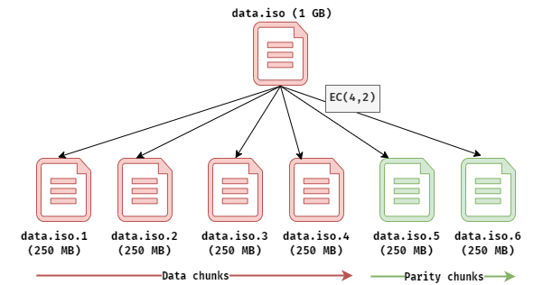
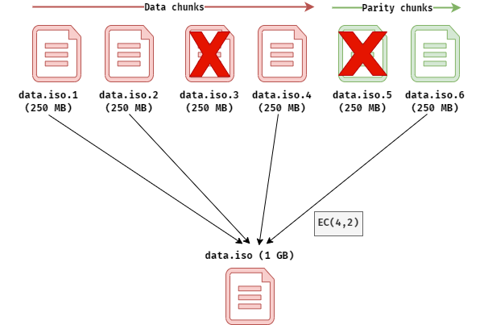

# ReedSolomon.NET 
[](https://github.com/egbakou/reedsolomon/actions/workflows/ci.yml) [](https://www.nuget.org/packages/ReedSolomon.NET/) [](https://github.com/egbakou/reedsolomon/blob/main/LICENSE)


Reed-Solomon Erasure coding implementation in C#/.NET.

This is a .NET Standard 2.1 port of the [JavaReedSolomon](https://github.com/Backblaze/JavaReedSolomon) library released by [Backblaze](http://backblaze.com/), without additional optimizations.

## What is Reed-Solomon?

Here is a well-explained article about the topic by [Backblaze](http://backblaze.com/) : https://www.backblaze.com/blog/reed-solomon/

## Motivation

I had an object storage project at school this year. I didn't want to use Azure Blob Storage or Amazon S3 because my Azure Student Credits and AWS credits were finished. I found `minio`, `nextcloud`, `seaweedfs`, and many other open-source projects for object storage, but I wanted to create something from scratch myself.

I did some research about the mechanism that `minio` and  `Azure Blob storage` used. I noticed that `minio` uses the Reed-Solomon Erasure Coding. For Azure Azure Blob Storage, Microsoft uses Erasure Coding but I don't really know if the implementation is Reed-Solomon. 

So I decided to use the Reed-Solomon Erasure Coding. There are already the Java, Go, and Python implementations of the Algorithm.

I followed the [Java implementation ](https://github.com/Backblaze/JavaReedSolomon) released by [Backblaze](http://backblaze.com/).

## Installation

ReedSolomon.NET can be [found here on NuGet](https://www.nuget.org/packages/ReedSolomon.NET) and can be installed by copying and pasting the following command into your Package Manager Console within Visual Studio (Tools > NuGet Package Manager > Package Manager Console).

```
Install-Package ReedSolomon.NET
```

Alternatively, you can install ReedSolomon.NET via the CLI with the following command:

```
dotnet add package ReedSolomon.NET
```

## Usage

 Take a look at the `ReedSolomon.NET.Sample` project in the `src` folder. 

You will find these three files: `SampleEncoder`, `SampleDecoder,` and `RemoteDecoder`. They show, in a very simple way, how to break a file into data chunks and parity chunks, and then how to take a subset of the shards and reconstruct the original file.

- `SampleEncoder.cs`

Break a file into data chunks and parity chunks.



- `SampleDecoder.cs`

Reconstruct the original file from data chunks and/or parity chunks.

In the illustration below, at least 4 "data chunks + Parity chunks" must be available, otherwise, the reconstruction will not be possible.



## Performance

The performance of the inner loop depends on the specific processor you're running on. There are twelve different permutations of the loop in this library, and the `ReedSolomonBenchmark` class will tell you which one is faster for your particular application.

These are the speeds I got running the benchmark on an AMD Ryzen 5 computer.

```powershell
InputOutputByteTableCodingLoop 304.8 MB/s
OutputInputByteTableCodingLoop 296.8 MB/s
InputOutputByteExpCodingLoop 258.3 MB/s
OutputByteInputExpCodingLoop 254.5 MB/s
OutputInputByteExpCodingLoop 241.6 MB/s
ByteOutputInputTableCodingLoop 234.6 MB/s
ByteOutputInputExpCodingLoop 234.2 MB/s
OutputByteInputTableCodingLoop 232.5 MB/s
InputByteOutputTableCodingLoop 152.0 MB/s
ByteInputOutputTableCodingLoop 145.5 MB/s
InputByteOutputExpCodingLoop 134.3 MB/s
ByteInputOutputExpCodingLoop 127.1 MB/s
```

## Limitation

- File size can't exceed 2GB due to the byte array limitation.

When I was working on my project, the maximum size of any file was 1GB, so I didn't care about this.

If you want to improve this project, check out the [NativeMemoryArray repo](https://github.com/Cysharp/NativeMemoryArray) to remove this limitation and feel free to make a PR.

- No performance optimization.

See the [Go implementation](https://github.com/klauspost/reedsolomon) to improve the performance of this project.

- You must run the benchmark on your hardware to detect the best inner loop to use.

See again the [Go implementation](https://github.com/klauspost/reedsolomon) and feel free to make a PR.

## Shortcomings

- If the shard number isn't the same for the decoder as in the encoder, invalid output will be generated.
- If values have changed in a shard, the original file cannot be reconstructed.
- If two shards have been swapped, reconstruction will always fail. You need to supply the shards in the same order as they were given to you.

The solution for this is to save a metadata file containing:

- File size.

- The number of data/parity shards.

- HASH of each shard.

- Order of the shards.

If you save these properties, you should be able to detect file corruption in a shard and be able to reconstruct your data if you have the needed number of shards left.

For security reasons, you can also encrypt each shard.

## Links

- [Backblaze Open Sources Reed-Solomon Erasure Coding Source Code](https://www.backblaze.com/blog/reed-solomon/).
- [JavaReedSolomon](https://github.com/Backblaze/JavaReedSolomon). Compatible java library by Backblaze.
- [klauspost/reedsolomon: Reed-Solomon Erasure Coding in Go (github.com)](https://github.com/klauspost/reedsolomon)
- [SDC 2018 - Accelerated Erasure Coding: The New Frontier of Software Defined Storage - YouTube](https://www.youtube.com/watch?v=4QFb2Zvr6yc)

- https://github.com/bwbeach)

## License

This project is licensed under the terms of the MIT license.
